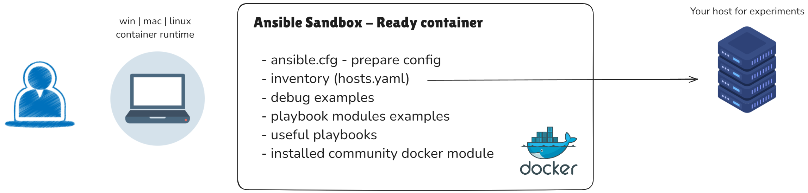

# Ansible Sandbox

Ready-made container and simple templates for Ansible experiments

> Any operating system will do, the main thing is to install docker (podman)




## Running

Clone repo
```sh
git clone https://github.com/akmalovaa/ansible-sandbox.git
cd ansible-sandbox
```

Build and run sandbox container
```sh
docker-compose up -d --build
```

Exec for play (enter the container)
```sh
docker-compose exec ansible bash
```

### Prepare

1) show version or check config - [ansible.cfg](ansible.cfg)
```sh
ansible --version
ansible-config view
```

2) update hosts file - [hosts.yaml](https://github.com/akmalovaa/ansible-sandbox/blob/main/ansible/hosts.yaml)

Сhange your hosts

> You can use a **password** or **ssh_key** to connect.
To connect via ssh, copy your `id_rsa` to the `ansible/ssh` directory.

3) check connect to hosts
```sh
ansible all -m ping
# ansible all -m ping -i hosts.yaml
# ansible all -m shell -a "lsb_release -a"
```
4) debug playbook
```sh
ansible-playbook ansible/debug.yaml
# ansible-playbook ansible/debug.yaml --extra-vars "{ 'my_variable':'test' }"
```

### Playbooks

[playbooks/apt.yaml](https://github.com/akmalovaa/ansible-sandbox/blob/main/ansible/playbooks/apt.yaml) module apt examples update and install packages 
```sh
ansible-playbook ansible/playbooks/apt.yaml
```

[playbooks/loop.yaml](https://github.com/akmalovaa/ansible-sandbox/blob/main/ansible/playbooks/apt.yaml) An example of using loops
```sh
ansible-playbook ansible/playbooks/loop.yaml
```

### Roles

Examples of simple roles

### Finish

`Ctrl + D` (exit the container)

```sh
docker-compose down -v
```


recommended:
- [awesome-ansible](https://github.com/ansible-community/awesome-ansible/blob/main/README.md)
- [github repo ansible user_guides](https://github.com/bhavikbhavsar/ansible/tree/devel/docs/docsite/rst/user_guide)
- 